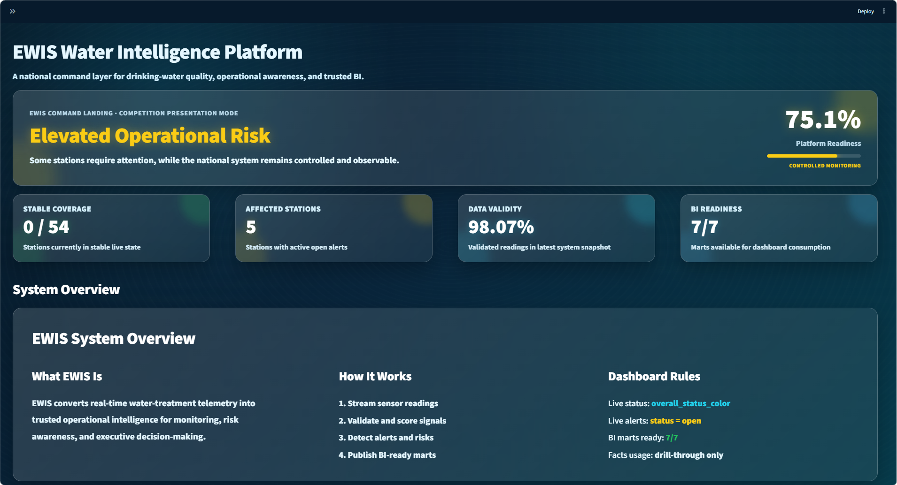
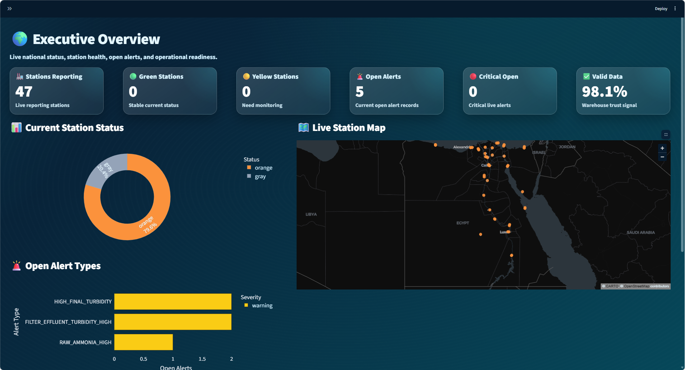
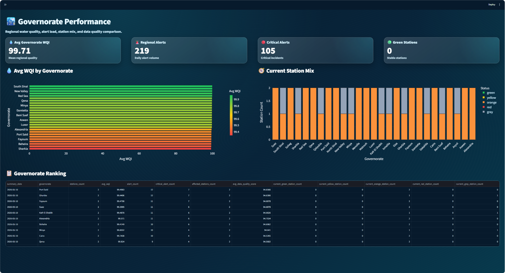
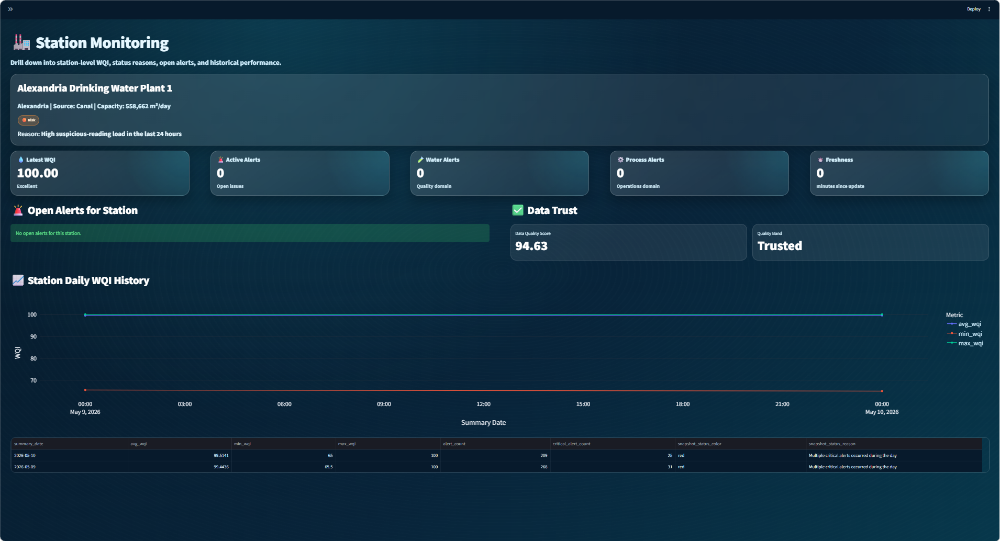
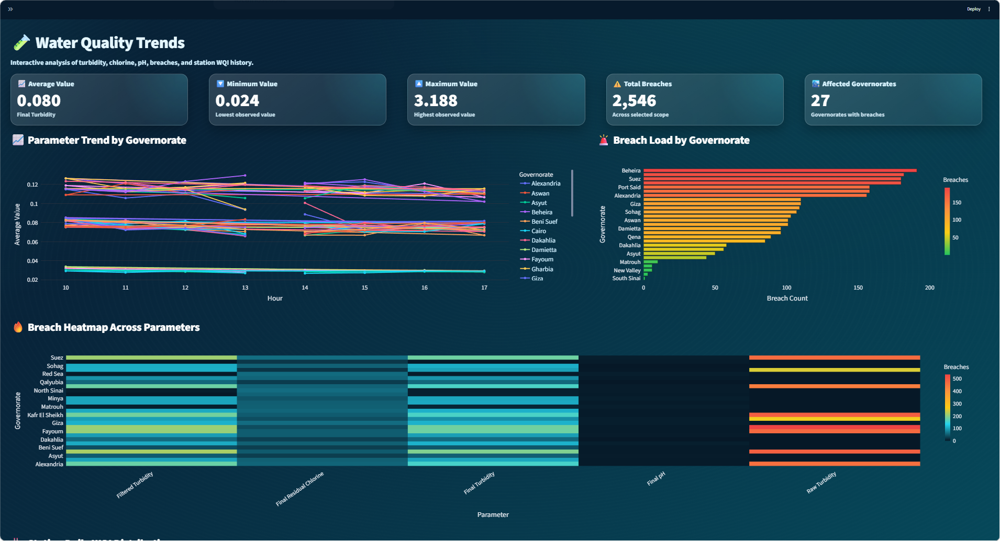
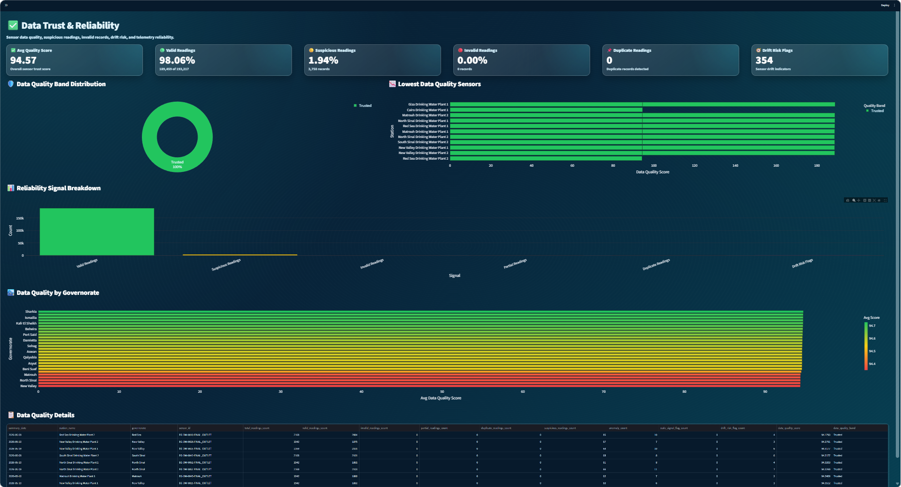

# 🌊 EWIS — Enterprise Water Intelligence System

## 📖 Project Overview

**EWIS** is an end-to-end **Data Engineering & Business Intelligence** platform designed for monitoring drinking-water treatment stations.

The system simulates sensor telemetry, streams operational readings, processes and validates water-quality signals, builds SQL Server analytical marts, and exposes an interactive **Streamlit dashboard** for executive and operational monitoring.

The project demonstrates how raw telemetry can be transformed into trusted, decision-ready intelligence through a complete modern data pipeline.

---

## 🎯 Project Objectives

EWIS was built to support water-infrastructure monitoring through:

- 🏭 Station-level operational monitoring
- 💧 Water Quality Index tracking
- 🚨 Alert detection and monitoring
- ✅ Sensor data quality and reliability scoring
- 🏙️ Governorate-level performance comparison
- 📊 Executive-ready analytical dashboards
- 🧱 BI-ready SQL Server data marts
- 🔁 Automated orchestration using Apache Airflow

---

## 🏗️ Project Architecture & Workflow

```text
Sensor Data Generator
        ↓
Kafka Topics
        ↓
Spark Processing
        ↓
SQL Server Data Warehouse
        ↓
Analytical BI Marts
        ↓
Streamlit Dashboard
```

### 1. Telemetry Simulation & Streaming 🔄

The project simulates operational water-treatment telemetry using Python scripts.

Key components:

- Sensor readings generator
- Station metadata
- Sensor metadata
- Reference threshold rules
- Kafka topic setup

Main files:

```text
airflow/dags/scripts/sensor_data_generator.py
airflow/dags/scripts/kafka_setup.py
shared/sensors_metadata.csv
shared/stations_metadata.csv
shared/reference_parameters.csv
shared/reference_threshold_rules.csv
```

---

### 2. Orchestration Layer ⚙️

Apache Airflow is used to orchestrate the full data pipeline.

The main DAG file is:

```text
airflow/dags/ewis_main_dag.py
```

The active DAG name used in the project is:

```text
EWIS_Enterprise_Final
```

The DAG handles:

- Running the database schema
- Setting up Kafka topics
- Loading metadata
- Loading reference data
- Streaming sensor readings
- Running Spark processing
- Building analytical marts

---

### 3. Processing Layer ⚡

Spark processing logic transforms streaming sensor readings into structured, validated, and analytics-ready outputs.

Main file:

```text
shared/spark_processor.py
```

The processing layer supports:

- Water-quality validation
- Threshold breach detection
- Alert logic
- WQI-related calculations
- Data quality checks
- Mart-level aggregation

---

### 4. Database & Warehouse Layer 🗄️

The SQL Server schema is defined in:

```text
airflow/dags/scripts/EWIS_Database_Schema.sql
```

Schema execution is handled by:

```text
airflow/dags/scripts/run_schema.py
```

The database includes:

- Operational tables
- Reference tables
- Analytical marts
- Data-quality monitoring structures
- Alert-monitoring structures

---

## 🛠️ Tech Stack

| Category | Tools & Libraries |
|---|---|
| **Programming** | Python |
| **Orchestration** | Apache Airflow |
| **Streaming** | Apache Kafka |
| **Processing** | Apache Spark |
| **Database** | Microsoft SQL Server |
| **Dashboard** | Streamlit |
| **Visualization** | Plotly, PyDeck |
| **Containerization** | Docker Compose |
| **Data Access** | SQLAlchemy, PyODBC |
| **Version Control** | Git, GitHub |

---

## 📂 Project Structure

```text
EWIS/
│
├── docker-compose.yml
│
├── airflow/
│   ├── Dockerfile
│   ├── dags/
│   │   ├── ewis_main_dag.py
│   │   └── scripts/
│   │       ├── EWIS_Database_Schema.sql
│   │       ├── kafka_setup.py
│   │       ├── meta_data.py
│   │       ├── reference_data.py
│   │       ├── run_schema.py
│   │       └── sensor_data_generator.py
│
├── dashboard_app/
│   ├── Home.py
│   ├── requirements.txt
│   ├── .streamlit/
│   │   └── config.toml
│   ├── assets/
│   │   ├── logo.png
│   │   └── styles.css
│   ├── pages/
│   │   ├── 1_Executive_Overview.py
│   │   ├── 2_Governorate_Overview.py
│   │   ├── 3_Station_Monitoring.py
│   │   ├── 4_Water_Quality_Trends.py
│   │   └── 5_Data_Trust.py
│   └── utils/
│       ├── db.py
│       ├── formatters.py
│       ├── queries.py
│       └── ui.py
│
├── shared/
│   ├── reference_parameters.csv
│   ├── reference_threshold_rules.csv
│   ├── sensors_metadata.csv
│   ├── spark_processor.py
│   └── stations_metadata.csv
│
├── docs/
│   ├── home.png
│   ├── executive_overview.png
│   ├── governate_performance.png
│   ├── station_monitoring.png
│   ├── water_quality_trends.png
│   └── data_trust.png
│
├── README.md
└── .gitignore
```

---

## 🧱 Analytical Data Marts

The dashboard consumes the following SQL Server analytical marts:

| Mart | Purpose |
|---|---|
| `mart_station_latest_status` | Latest station operational and water-quality status |
| `mart_system_readiness_summary` | National platform readiness and data-validity summary |
| `mart_governorate_daily_summary` | Governorate-level WQI, station mix, and alert summaries |
| `mart_parameter_trend` | Time-bucketed parameter trends and breach counts |
| `mart_station_daily_snapshot` | Daily station WQI and historical station status |
| `mart_alert_monitor` | Open and historical alert monitoring |
| `mart_data_quality_monitor` | Sensor reliability, invalid readings, suspicious readings, and drift-risk metrics |

---

## 📘 KPI Reference Table

The project also includes a KPI reference table:

```text
ref_kpi_definition
```

This table documents KPI metadata such as:

- KPI code
- KPI name
- KPI group
- Business definition
- Source object
- Refresh grain
- Interpretation hint

This table supports KPI governance and explainability. It is used as a semantic reference layer, but it is not exposed as a dedicated dashboard page in the current Streamlit dashboard.

---

# 📊 Streamlit Dashboard

The dashboard is located in:

```text
dashboard_app/
```

The main dashboard entry point is:

```text
dashboard_app/Home.py
```

The dashboard includes 6 main views:

1. Home
2. Executive Overview
3. Governorate Performance
4. Station Monitoring
5. Water Quality Trends
6. Data Trust

---

## 🏠 1. Home

The **Home** page is the executive landing page for the EWIS platform. It summarizes the current national water-intelligence status and highlights whether the platform is stable, under monitoring, or requires operational attention.

### Key insights shown:

- Platform readiness score
- Current system status
- Stable station coverage
- Affected stations
- Data validity
- BI mart readiness
- System overview
- Recommended navigation

### Main marts used:

- `mart_system_readiness_summary`
- `mart_station_latest_status`
- `mart_alert_monitor`

### Dashboard Preview



---

## 🌍 2. Executive Overview

The **Executive Overview** page provides national-level monitoring for station health, live operational status, alert distribution, and geographic station visibility.

### Key insights shown:

- Station status distribution
- Open alert types
- Live station map
- Priority stations table
- National operational KPIs

### Main marts used:

- `mart_system_readiness_summary`
- `mart_station_latest_status`
- `mart_alert_monitor`

### Dashboard Preview



---

## 🏙️ 3. Governorate Performance

The **Governorate Performance** page compares regional water-quality and operational behavior across governorates. It helps identify which regions have stronger WQI performance, higher alert load, or unstable station-status mixes.

### Key insights shown:

- Average WQI by governorate
- Current station status mix
- Governorate ranking
- Regional alert load
- Critical alert counts

### Main mart used:

- `mart_governorate_daily_summary`

### Dashboard Preview



---

## 🏭 4. Station Monitoring

The **Station Monitoring** page provides station-level drill-down analysis. It allows users to select a governorate and station, then inspect station WQI, alert reasons, data freshness, and historical daily performance.

### Key insights shown:

- Selected station details
- Latest WQI
- Active alerts
- Water-quality alerts
- Process alerts
- Data freshness
- Open alerts for station
- Data trust metrics
- Station daily WQI history

### Main marts used:

- `mart_station_latest_status`
- `mart_alert_monitor`
- `mart_station_daily_snapshot`
- `mart_data_quality_monitor`

### Dashboard Preview



---

## 🧪 5. Water Quality Trends

The **Water Quality Trends** page focuses on analytical exploration of water-quality parameters such as turbidity, chlorine, pH, breaches, and WQI distribution.

### Key insights shown:

- Parameter trend by governorate
- Breach load by governorate
- Breach heatmap across parameters
- Station daily WQI distribution
- Parameter trend records

### Main marts used:

- `mart_parameter_trend`
- `mart_station_daily_snapshot`

### Dashboard Preview



---

## ✅ 6. Data Trust

The **Data Trust** page evaluates telemetry reliability and sensor quality. It helps distinguish between real operational issues and problems caused by unreliable sensor readings.

### Key insights shown:

- Average data quality score
- Valid readings
- Suspicious readings
- Invalid readings
- Duplicate readings
- Drift-risk flags
- Data quality band distribution
- Lowest-quality sensors
- Data quality by governorate
- Data quality details table

### Main marts used:

- `mart_data_quality_monitor`
- `mart_system_readiness_summary`

### Dashboard Preview



---

# 🚀 How to Run the Project

## 1. Start Docker Services

From the project root folder:

```powershell
docker compose up -d
```

This starts the containerized services defined in:

```text
docker-compose.yml
```

Depending on the local environment, the services may include:

- Airflow
- Kafka
- Spark
- SQL Server
- Supporting services

---

## 2. Open Airflow

After Docker services are running, open Airflow in the browser:

```text
http://localhost:8080
```

Then trigger the main DAG:

```text
EWIS_Enterprise_Final
```

or the active DAG configured in:

```text
airflow/dags/ewis_main_dag.py
```

---

## 3. Run the Streamlit Dashboard

Open a terminal and navigate to the dashboard folder:

```powershell
cd "C:\Users\scisa\Desktop\projects\Depi Project\dashboard_app"
```

Run Streamlit:

```powershell
streamlit run Home.py
```

Then open:

```text
http://localhost:8501
```

If port `8501` is already in use:

```powershell
streamlit run Home.py --server.port 8502
```

Then open:

```text
http://localhost:8502
```

---

# 🔁 Important Clean Rerun Note

Before running the full pipeline from scratch again, remove old runtime state files.

The project contains runtime markers and checkpoints such as:

```text
airflow/dags/.metadata_sent
airflow/dags/.reference_sent
shared/checkpoints/
airflow/logs/
```

These files are generated during previous pipeline runs.

If the project is rerun from the beginning, old flags and checkpoints may cause steps to be skipped or may make streaming jobs continue from previous offsets.

For a clean rerun, remove runtime state such as:

```powershell
Remove-Item -Force .\airflow\dags\.metadata_sent -ErrorAction SilentlyContinue
Remove-Item -Force .\airflow\dags\.reference_sent -ErrorAction SilentlyContinue
Remove-Item -Recurse -Force .\shared\checkpoints -ErrorAction SilentlyContinue
```

Airflow logs can also be removed before pushing to GitHub:

```powershell
Remove-Item -Recurse -Force .\airflow\logs -ErrorAction SilentlyContinue
```

Do not delete source code, SQL scripts, dashboard files, reference CSVs, or Docker configuration.

---

# 📦 Dashboard Requirements

The Streamlit dashboard dependencies are stored in:

```text
dashboard_app/requirements.txt
```

Install requirements using:

```powershell
pip install -r dashboard_app/requirements.txt
```

---

# 🔄 Dashboard Refresh

The dashboard pages use automatic refresh:

```python
st_autorefresh(interval=30000)
```

This means the dashboard refreshes approximately every 30 seconds to show updated mart data.

---

# 🧠 Key Business Logic

## Open Alerts

Only currently open alerts are treated as active:

```sql
WHERE status = 'open'
```

## Station Status

Station status is driven by:

```text
overall_status_color
```

Typical status colors:

| Color | Meaning |
|---|---|
| Green | Stable |
| Yellow | Monitoring required |
| Orange | Elevated risk |
| Red | Critical attention required |
| Gray | Missing or unavailable signal |

## Data Trust

Data reliability is evaluated using:

- Valid readings
- Invalid readings
- Partial readings
- Duplicate readings
- Suspicious readings
- Stale signal flags
- Drift-risk indicators
- Data quality score
- Data quality band

---

# 🌟 Project Value

EWIS demonstrates an end-to-end data engineering solution that connects streaming telemetry, data quality controls, mart modeling, orchestration, and business intelligence visualization.

The project shows how raw sensor readings can be transformed into trusted operational intelligence for water infrastructure monitoring.

---

# 👤 Author

Built as an end-to-end data engineering and BI project for water intelligence monitoring.
